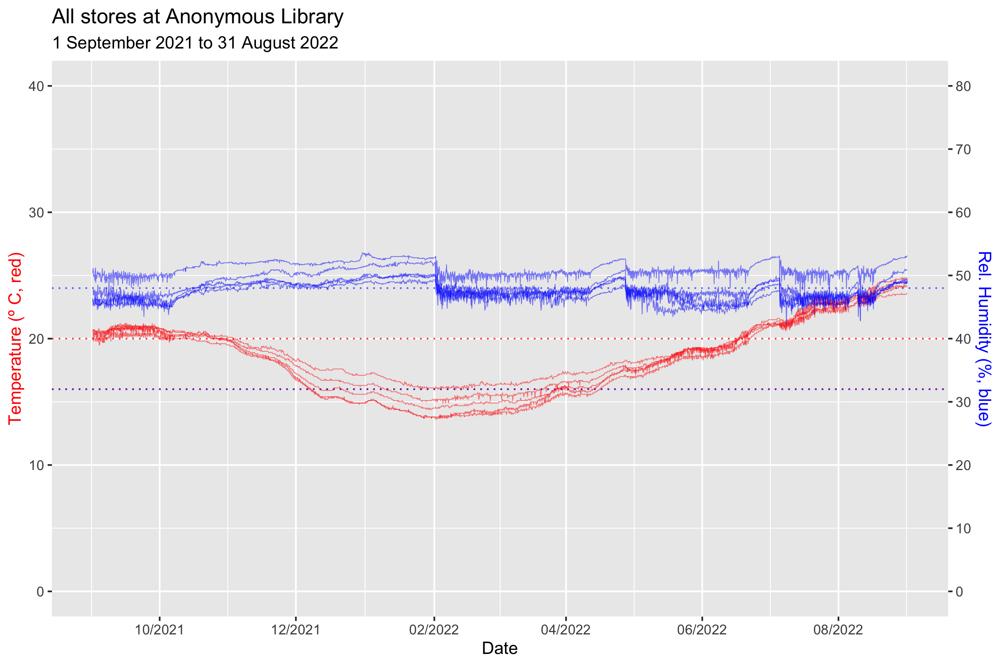
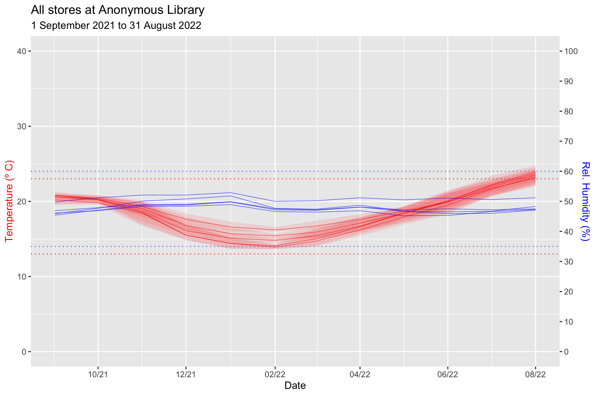
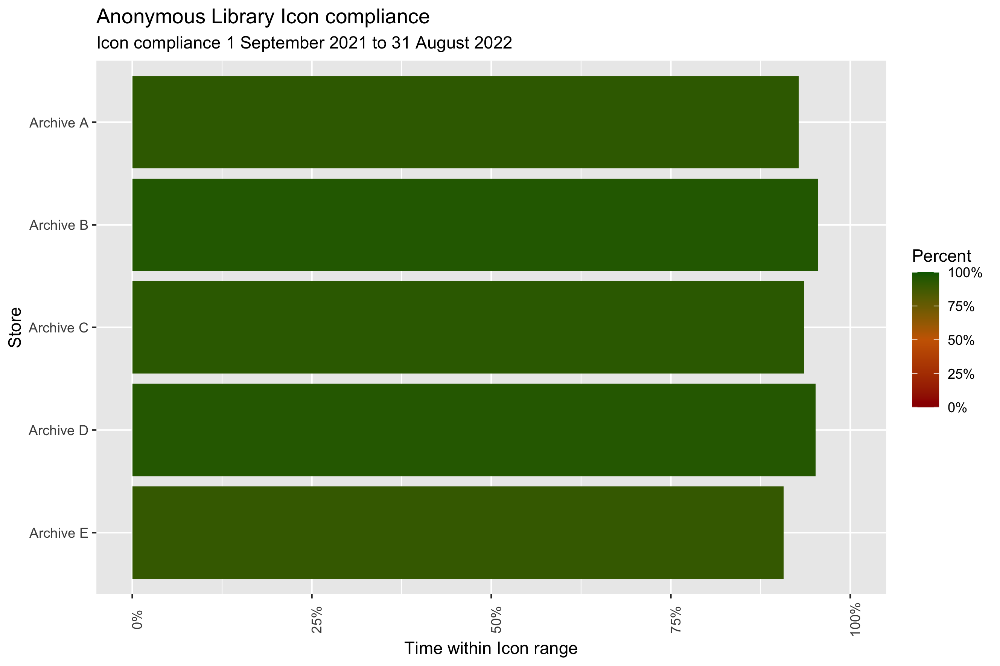
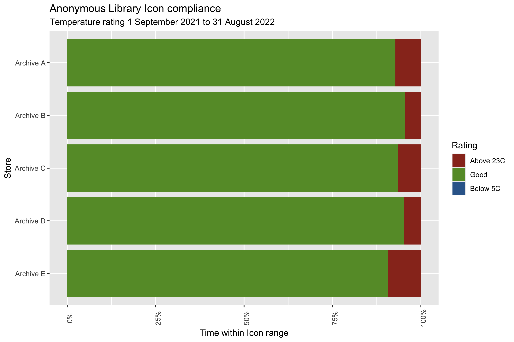

# dataloggergraphs
Adapts .csv files exported from different brands of datalogger to a common format, and combines them into a .csv file and graph.

Currently supports Meaco, MiniClima, Rotronic, Tinytag, and Trend BMS temperature and humidity loggers, and Meaco and T&D light loggers.
If you have another brand and a sample file, please feel free to open an issue or send a pull request.

Columns and types are:

venue     (char)

location  (char)

datetime  (date, POSIXct)

temp      (dbl)

RH        (dbl)

lux       (dbl)

UV        (dbl)

model     (str)

serial    (str)

It creates and graphs annual, monthly, or daily summaries including minimum, maximum, mean, as well as the 1st and 99th percentile to give a better idea of the data without rare spikes.

It creates and graphs standard compliance, with support for BS 4971, PAS 198, Bizot Green Protocol, and Icon sustainability parameters from the 2023 guidance note, or you can set the parameters yourself.

There is also a move script, which compiles data from different sites and makes a graph splicing two stores.
